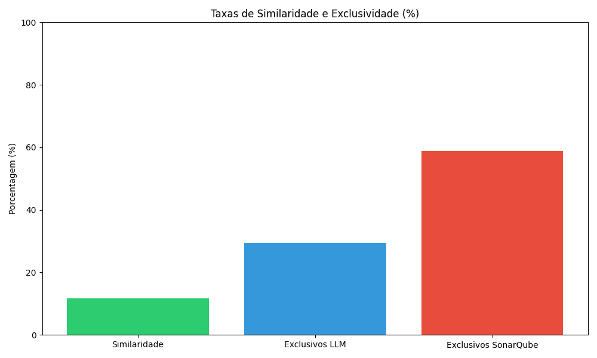

# Relatório GQM: Comparação entre LLM e SonarQube na Detecção de Code Smells

Repositório analisado: **Code_Smells**

## Questãoo 1: Qual das duas abordagens detecta mais code smells clássicos?

### Métrica 1.1: Número total de code smells detectados

| Abordagem | Quantidade de Smells |
|-----------|----------------------|
| LLM | 7 |
| SonarQube | 12 |
| Diferença absoluta | 5 |
| Relação percentual (LLM/SonarQube) | 58.33% |

### Métrica 1.2: Média de code smells detectados por arquivo

| Abordagem | Média de Smells por Arquivo | Arquivos com Smells |
|-----------|------------------------------|---------------------|
| LLM | 7.00 | 1 |
| SonarQube | 6.00 | 2 |

### Métrica 1.3: Diferença média de detecção por arquivo

- Diferença média por arquivo
- Número de arquivos comuns analisados

## Questão 2: As duas abordagens convergem ou divergem nos resultados?

### Métrica 2.1: Porcentagem de smells detectados simultaneamente

| Métrica | Valor |
|---------|-------|
| Smells detectados por ambas abordagens | 2 |
| Total de smells únicos (uni�o) | 5 |
| Taxa de similaridade | 40.00% |

### Métrica 2.2: Porcentagem de smells exclusivos

| Métrica | Valor |
|---------|-------|
| Smells exclusivos LLM | 3 |
| Smells exclusivos SonarQube | 0 |
| Taxa de exclusividade LLM | 60.00% |
| Taxa de exclusividade SonarQube | 0.00% |

### Métrica 2.3: Número de categorias com alta/baixa sobreposição

| Métrica | Valor |
|---------|-------|
| Categorias com alta sobreposição (>80%) | 2 |
| Categorias com baixa sobreposição (<20%) | 3 |
| Total de categorias analisadas | 5 |

## Questão 3: Existem categorias de smells mais detectadas por cada abordagem?

### Métrica 3.1: Número médio de smells por categoria

- LLM: média de **1.40** smells por categoria
- SonarQube: média de **6.00** smells por categoria

| Categoria | LLM | SonarQube |
|-----------|-----|----------|
| Duplicate Code | 2 | 0 |
| Exception Handling | 1 | 6 |
| Feature Envy | 1 | 0 |
| Long Method | 2 | 0 |
| Magic Numbers | 1 | 6 |

### Métrica 3.2: Porcentagem de smells simultâneos por categoria

| Categoria | Número de Smells Simultâneos | % de Simultaneidade |
|-----------|------------------------------|--------------------|
| Duplicate Code | 0 | 0.00% |
| Exception Handling | 1 | 100.00% |
| Feature Envy | 0 | 0.00% |
| Long Method | 0 | 0.00% |
| Magic Numbers | 1 | 100.00% |

### Métrica 3.3: Porcentagem de smells exclusivos por categoria

| Categoria | Exclusivos LLM | % LLM | Exclusivos SonarQube | % SonarQube |
|-----------|----------------|-------|---------------------|-------------|
| Duplicate Code | 1 | 100.00% | 0 | 0.00% |
| Exception Handling | 0 | 0.00% | 0 | 0.00% |
| Feature Envy | 1 | 100.00% | 0 | 0.00% |
| Long Method | 1 | 100.00% | 0 | 0.00% |
| Magic Numbers | 0 | 0.00% | 0 | 0.00% |

## Conclusões

### Questão 1: Qual das duas abordagens detecta mais code smells clássicos?

O SonarQube detectou mais code smells (12) em comparação com a abordagem LLM (7). A diferença média por arquivo foi de 5.00 smells, o que indica uma discrepância significativa entre as abordagens na detecção em nível de arquivo.

### Questão 2: As duas abordagens convergem ou divergem nos resultados?

A taxa de similaridade entre as abordagens foi de 40.00%, indicando uma **divergência moderada** entre os resultados. Das 5 categorias analisadas, 2 apresentaram alta sobreposição (>80%) e 3 apresentaram baixa sobreposiçãoo (<20%).

### Questão 3: Existem categorias de smells mais detectadas por cada abordagem?

A LLM detectou mais frequentemente smells da categoria **Long Method** com 2 ocorrências. O SonarQube detectou mais frequentemente smells da categoria **Exception Handling** com 6 ocorrências.

A categoria com maior divergência entre as abordagens foi **Duplicate Code**, com 100.00% de detecções exclusivas somadas.

## Recomendações

Com base na análise realizada, recomenda-se:

1. **Abordagem complementar**: Utilizar ambas as ferramentas em conjunto, já que apresentam uma taxa de similaridade de apenas 40.00%, complementando-se na detecção.

2. **Foco em categorias específicas**: A LLM mostrou maior eficiência na detecção de smells do tipo **Long Method**, enquanto o SonarQube se destacou em **Exception Handling**. Considerar essa especialização ao escolher a ferramenta adequada.

3. **Validação humana**: Para as categorias com baixa sobreposição entre as ferramentas, é recomendada uma revisão manual para validar os resultados e identificar os falsos positivos.

4. **Refinamento de prompts**: Os resultados sugerem oportunidades para aprimorar a engenharia de prompts para as LLMs, especialmente nas categorias onde o SonarQube se mostrou mais eficaz.

